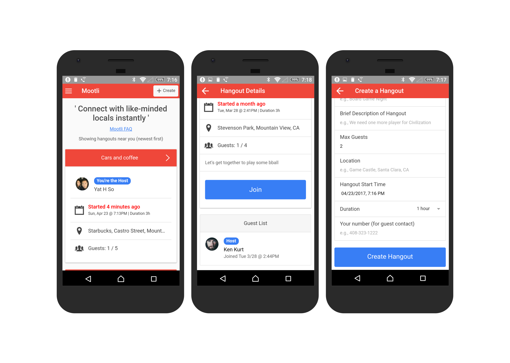
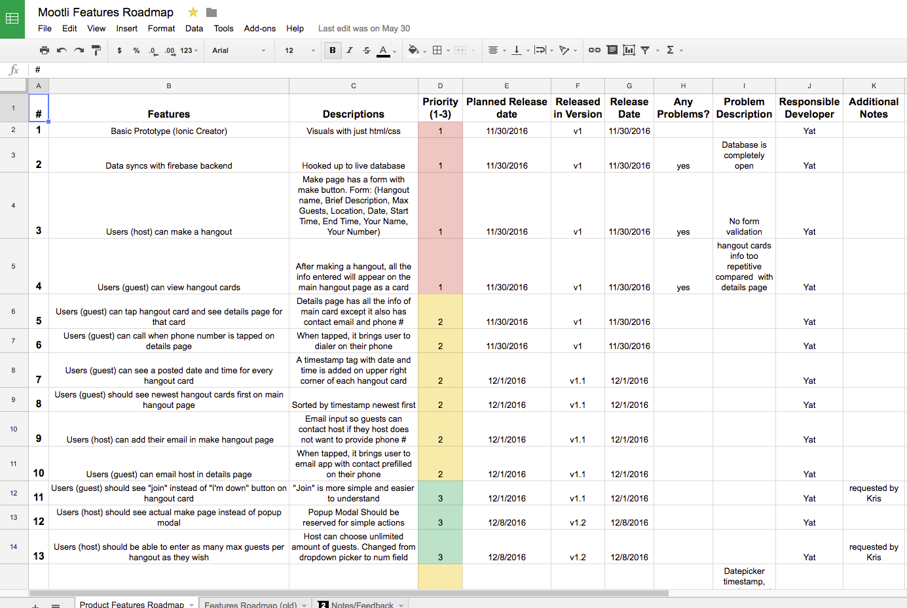

## Live Demo: https://mootli-c5f77.firebaseapp.com

# Mootli

Instant-meetup mobile web app built with Ionic(HTML/CSS/AngularJS) 

## Product Requirements Spreadsheet

Live spreadsheet of where I keep track of features/bug fixes for this project
https://docs.google.com/spreadsheets/d/1GaF2uSGtYqp_x7WCN6OPS8zzinh-zz7LESXUQ58sB8k/edit?usp=sharing

## Authors

* **Yat So**  - [yatso](https://github.com/yatso)
